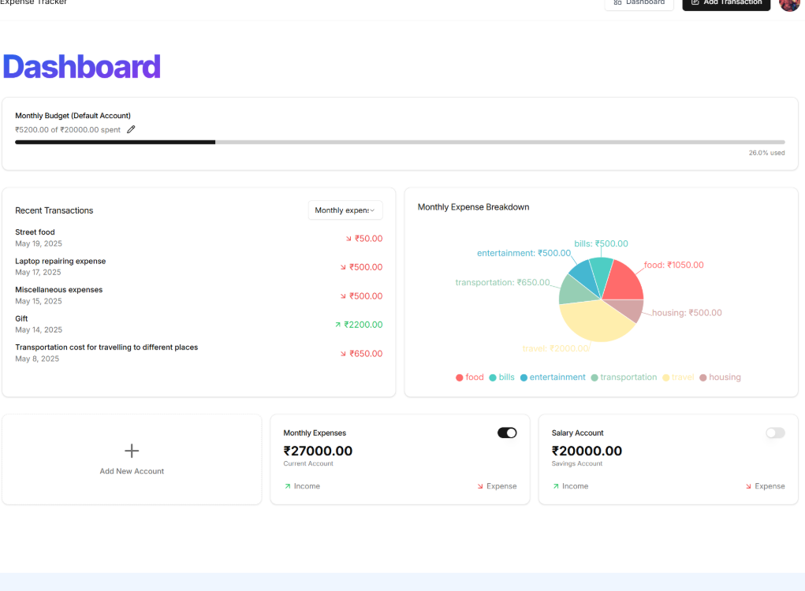
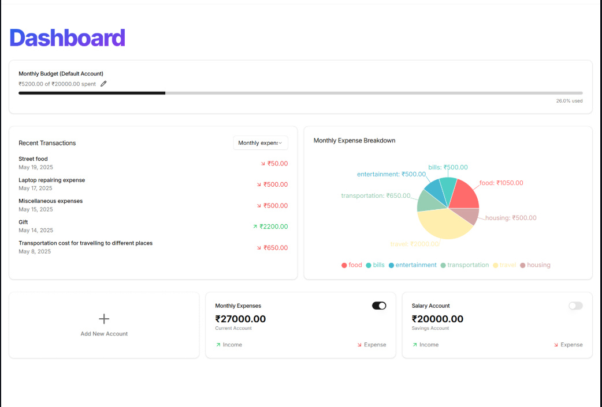
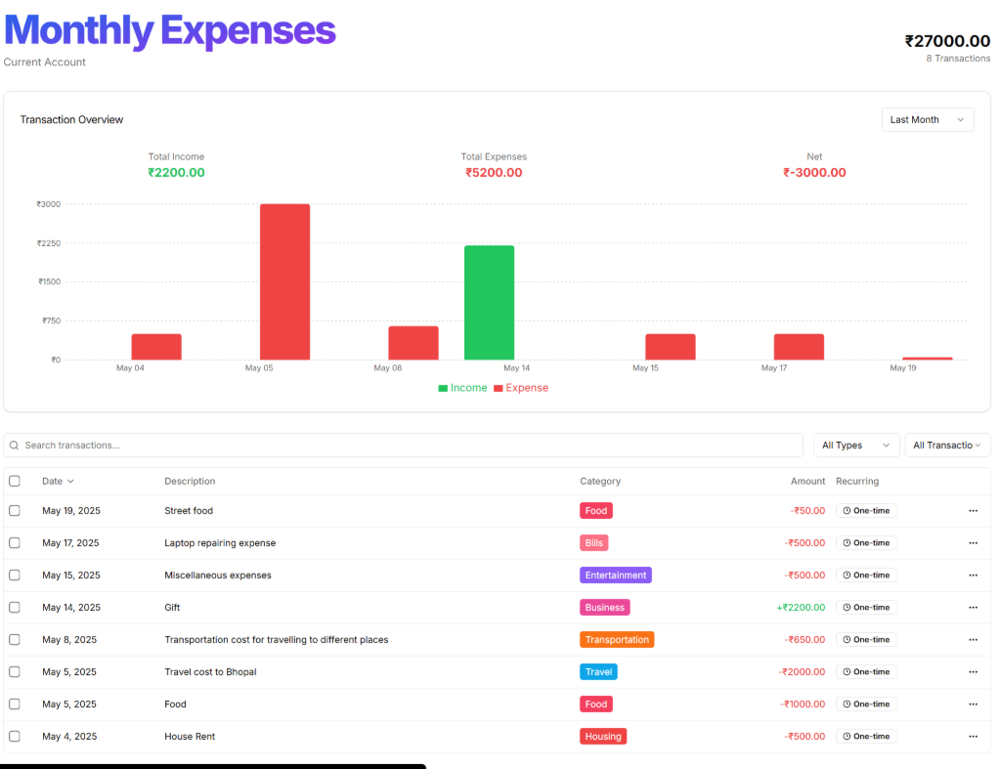

# 📊 AI Expense Tracker

[](https://reactjs.org/)
[](https://nextjs.org/)
[](https://tailwindcss.com/)

## 🧠 About the Project

**AI Expense Tracker** is a modern and intelligent platform that allows users to track their expenses efficiently using an intuitive UI and smart features like AI-based categorization. Designed for individuals and professionals, this app helps users make informed financial decisions through real-time insights, seamless account management, and personalized dashboards.

---

## 💡 Why This Project?

Managing finances manually can be tedious. I wanted to build a smart, AI-powered app that automates categorization, simplifies tracking, and provides a beautiful user experience — helping everyone focus on *how* they spend, not *how* to track it.

---

## 🚀 Features

| Feature                        | Description                                                                 |
|-------------------------------|-----------------------------------------------------------------------------|
| 🔐 **Authentication**         | Secure login/signup with Clerk                                              |
| 🧾 **Expense Tracking**        | Log, view, and categorize expenses easily                                   |
| 📈 **Dashboard**              | Get visual insights into your spending trends                              |
| ⚙️ **Account Management**     | Create and manage multiple accounts                                        |
| 🗒️ **Download Transactions**  | Get Transaction details in csv file                                        |
| 📬 **Email Notifications**    | Transaction alerts and summaries via Resend                                |
| 📦 **Serverless Functions**   | Background jobs & workflows using Inngest                                  |
| 🔐 **Rate Limiting**          | Protect endpoints with Arcjet                                              |
| 🎨 **ShadCN UI**              | Beautiful components with full Tailwind CSS integration                    |

---

## 🛠️ Tech Stack

| Layer         | Tech                                    |
|---------------|------------------------------------------|
| Frontend      | Next.js 15, React, Tailwind CSS          |
| Backend       | Node.js, Supabase, Prisma ORM            |
| Auth          | Clerk                                    |
| AI Features   | Gemini API                               |
| Emails        | Resend                                   |
| Jobs/Events   | Inngest                                  |
| Security      | Arcjet                                   |
| UI Components | ShadCN UI, Lucide Icons                  |
| Hosting       | Vercel                                   |

---

## 📸 Screenshots

### 🏠 Landing Page


### 📊 Dashboard View


### 📈 Expenses Breakdown


---

## 🧪 Local Development

### 🔧 Environment Setup

Create a `.env` file in the root and add the following:

```
NEXT_PUBLIC_CLERK_PUBLISHABLE_KEY=your_key
CLERK_SECRET_KEY=your_key
NEXT_PUBLIC_SUPABASE_URL=your_url
SUPABASE_SERVICE_ROLE_KEY=your_key
NEXT_PUBLIC_SUPABASE_ANON_KEY=your_key
RESEND_API_KEY=your_resend_key
INNGEST_EVENT_KEY=your_key
```

---

### 📦 Installation

#### Clone the repo
```
git clone https://github.com/yourusername/expense-tracker.git
cd expense-tracker
```

#### Install dependencies
```
npm install
```

#### Start dev server
```
npm run dev
```

---

## 🛣️ Future Roadmap

- [ ] AI categorization of expenses
- [ ] Recurring expense prediction
- [ ] Monthly budget planner
- [ ] Mobile app (React Native)

---

## 🙌 Acknowledgments

- [ShadCN UI](https://ui.shadcn.dev)
- [Clerk](https://clerk.dev)
- [Supabase](https://supabase.com)
- [Resend](https://resend.com)
- [Inngest](https://www.inngest.com/)
- [Arcjet](https://arcjet.com)
- [Vercel](https://vercel.com)
